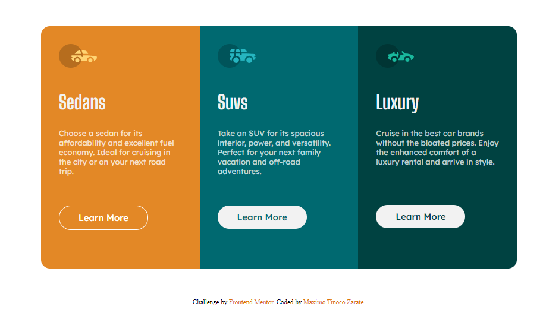
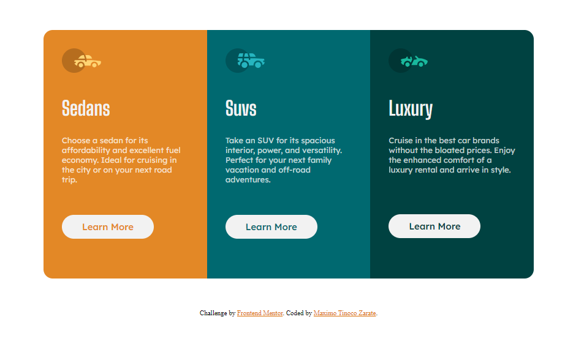

# Mentor frontend - Product preview card component fix

This is a solution to [Mentor Frontend Product Preview Card Component Challenge] (https://www.frontentmentor.io/challenges/product-preview-card-component-go7umttrfa). Mentor Frontend Challenges They help you improve your coding skills by creating realistic projects.

### The challenge

Users should be able to:

- View the optimal layout depending on their device's screen size
- See hover states for interactive elements

### Screenshot

### Links

- Solution URL: [Repository](https://github.com/MaximoTz/3-Column-Preview-Card-Component)
- Live Site URL: [3 Column preview card](https://3-column-preview-card-maxdevs.netlify.app/)

### Built with

- Semantic HTML5 markup
- CSS custom properties
- Flexbox
- CSS Grid
- Mobile-first workflow

### What I learned

I keep improving with my responsive designs to the point that the image is no longer distorted when using a query

To see how you can add code snippets, see below:

### Continuous development

I want to focus more on being able to expand my knowledge and thus improve my mobile designs while improving on other topics.

## Author

- Name - Maximo Tinoco Zarate
- Frontend Mentor - [@MaximoTz](https://www.frontendmentor.io/profile/MaximoTz)
